**Advanced Lane Finding Project**

The goals / steps of this project are the following:

* Compute the camera calibration matrix and distortion coefficients given a set of chessboard images.
* Apply a distortion correction to raw images.
* Use color transforms, gradients, etc., to create a thresholded binary image.
* Apply a perspective transform to rectify binary image ("birds-eye view").
* Detect lane pixels and fit to find the lane boundary.
* Determine the curvature of the lane and vehicle position with respect to center.
* Warp the detected lane boundaries back onto the original image.
* Output visual display of the lane boundaries and numerical estimation of lane curvature and vehicle position.

### Camera Calibration

#### Camera calibration involves computing the camera matrix and distortion coefficients. 

The code for this step is contained in the first code cell of the IPython notebook located in "./advanced_lane_lines.ipynb". 

The idea is that you take pictures of known shape such as a black-white chessboard. You can use `cv2.findChessboardCorners()` function to find all corners where black and white intersects. These corner points, an array of (x,y), are used to create my so-called image points (i.e. an array of array of points `imgpoints`). 

The "object points", on the other hand, are the (x, y, z) coordinates of the chessboard corners in the world. Here I am assuming the chessboard is fixed on the (x, y) plane at z=0, such that the object points are the same for each calibration image.  Thus, `objp` is just a replicated array of coordinates, and `objpoints` will be appended with a copy of it every time I successfully detect all chessboard corners in a test image.  `imgpoints` will be appended with the (x, y) pixel position of each of the corners in the image plane with each successful chessboard detection.  

I then used the two arrays `objpoints` and `imgpoints` to compute the camera calibration and distortion coefficients using the `cv2.calibrateCamera()` function.  Lastlt, I applied this distortion correction to the test image using the `cv2.undistort()` function and show the original and undistorted images side-by-side.


```python
import pickle
import cv2
import numpy as np
import matplotlib.pyplot as plt
import matplotlib.image as mpimg
import glob
%matplotlib inline

images = glob.glob('camera_cal/calibration*.jpg')
nx = 9 #the number of inside corners in x
ny = 6 #the number of inside corners in y
board_size = (nx, ny)
objpoints = [] # 3d points in real world space
imgpoints = [] # 2d points in image plane.

# prepare object points, like (0,0,0), (1,0,0), (2,0,0) ....,(6,5,0)
objp = np.zeros((ny*nx,3), np.float32)
objp[:,:2] = np.mgrid[0:nx, 0:ny].T.reshape(-1,2)

for imgfile in images:
    img = cv2.imread(imgfile)
    gray = cv2.cvtColor(img, cv2.COLOR_BGR2GRAY)
    ret, corners = cv2.findChessboardCorners(gray, board_size, None)
    if ret == True:
        ## print('found chessboard: ', imgfile)
        objpoints.append(objp)
        imgpoints.append(corners)

ret, mtx, dist, rvecs, tvecs = cv2.calibrateCamera(objpoints, imgpoints, img.shape[0:2], None, None)    

# Save the camera calibration matrix and distortion coefficients
dist_pickle = {}
dist_pickle["mtx"] = mtx
dist_pickle["dist"] = dist
dist_pickle["objpoints"] = objpoints
dist_pickle["imgpoints"] = imgpoints
pickle.dump( dist_pickle, open( "wide_dist_pickle.p", "wb" ) )

# Testing 
img = mpimg.imread('camera_cal/calibration1.jpg')
undist = cv2.undistort(img, mtx, dist, None, mtx)
# img2 = cv2.drawChessboardCorners(img, board_size, corners, ret)

def draw_two_imgs(img1, img2, title1='Original Image', title2='Undistorted Image'):
    f, (ax1, ax2) = plt.subplots(1, 2, figsize=(18, 9))
    f.tight_layout()
    ax1.imshow(img1)
    ax1.set_title(title1, fontsize=24)
    ax2.imshow(img2)
    ax2.set_title(title2, fontsize=24)
    plt.subplots_adjust(left=0., right=1, top=0.9, bottom=0.)
    
draw_two_imgs(img, undist)
```


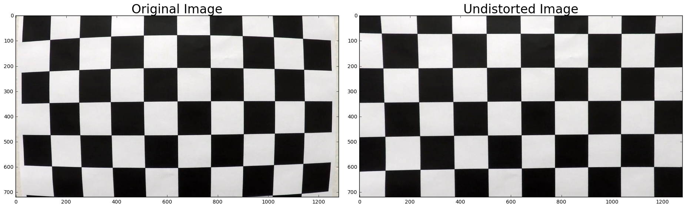


```python
dist_pickle = pickle.load( open( "wide_dist_pickle.p", "rb" ) )
mtx = dist_pickle["mtx"]
dist = dist_pickle["dist"]

img = mpimg.imread('test_images/straight_lines1.jpg')
undistorted = cv2.undistort(img, mtx, dist, None, mtx)
draw_two_imgs(img, undistorted)
```


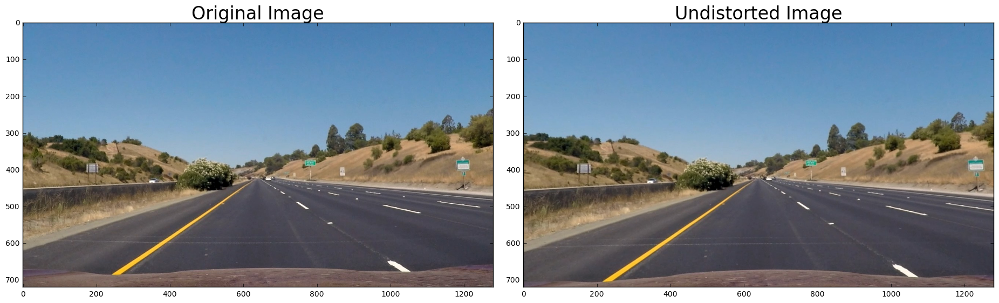


### Pipeline (single images)

#### 1. Camera calibration on a test image

Since we saved our camera calibration matrix and distortion coefficients in a pickle file, we can easily read these parameters back and undistort another image. 


```python
img = mpimg.imread('test_images/test2.jpg')
undistorted = cv2.undistort(img, mtx, dist, None, mtx)
draw_two_imgs(img, undistorted)
```


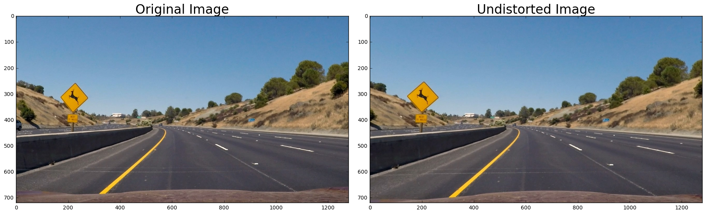


#### 2. Create a thresholded binary image

I used a combination of color space and gradient thresholds to generate a binary image. For color thresholding, I first converted the image from RGB colorspace to HLS colorspace. This line is then used to threshold the _s_ chanel `s_binary[(s_channel >= s_thresh[0]) & (s_channel <= s_thresh[1])] = 1` Gradient thresholding step is similar and done on the Sobel x gradient `sxbinary[(scaled_sobel >= sx_thresh[0]) & (scaled_sobel <= sx_thresh[1])] = 1`. I also compute the combined bianry with `combined_binary[(s_binary == 1) | (sxbinary == 1)] = 1`. At the end is an example of my output for this step.


```python
image = mpimg.imread('test_images/straight_lines1.jpg')

# Edit this function to create your own pipeline.
def pipeline(img, s_thresh=(120, 255),sx_thresh=(20, 255),l_thresh=(40,255)):
    img = np.copy(img)
    # Convert to HSV color space and separate the V channel
    hsv = cv2.cvtColor(img, cv2.COLOR_RGB2HLS).astype(np.float)
    l_channel = hsv[:,:,1]
    s_channel = hsv[:,:,2]
    # Sobel x
    sobelx = cv2.Sobel(l_channel, cv2.CV_64F, 1, 0) # Take the derivative in x
    abs_sobelx = np.absolute(sobelx) # Absolute x derivative to accentuate lines away from horizontal
    scaled_sobel = np.uint8(255*abs_sobelx/np.max(abs_sobelx))
    
    # Threshold x gradient
    sxbinary = np.zeros_like(scaled_sobel)
    sxbinary[(scaled_sobel >= sx_thresh[0]) & (scaled_sobel <= sx_thresh[1])] = 1
    
    # Threshold s channel
    s_binary = np.zeros_like(s_channel)
    s_binary[(s_channel >= s_thresh[0]) & (s_channel <= s_thresh[1])] = 1
    
    # Threshold l channel
    l_binary = np.zeros_like(l_channel)
    l_binary[(l_channel >= l_thresh[0]) & (l_channel <= l_thresh[1])] = 1
    
    # Stack each channel
    # Note color_binary[:, :, 0] is all 0s, effectively an all black image. It might
    # be beneficial to replace this channel with something else.
    color_binary = np.dstack(( np.zeros_like(sxbinary), sxbinary, s_binary))
    
    # Combine the three binary thresholds
    binary = np.zeros_like(sxbinary)
    binary[((l_binary == 1) & (s_binary == 1) | (sxbinary==1))] = 1
    # combined_binary = 255*np.dstack((binary,binary,binary)).astype('uint8')
    return color_binary, binary
    
result, combined_binary = pipeline(image)

# Plot the result
f, (ax1, ax2, ax3) = plt.subplots(1, 3, figsize=(24, 9))
f.tight_layout()

ax1.imshow(image)
ax1.set_title('Original Image', fontsize=40)

ax2.imshow(result)
ax2.set_title('Color Binary', fontsize=40)

#combined_binary = 255*np.dstack((binary,binary,binary)).astype('uint8')
ax3.imshow(combined_binary, cmap='gray')
ax3.set_title('Combined Binary', fontsize=40)

plt.subplots_adjust(left=0., right=1, top=0.9, bottom=0.)
```


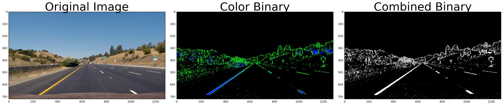


#### 3. Perspective transform

The code for my perspective transform includes a function called `warper()`, which appears in lines 1 through 12 in the code block below. The `warper()` function takes as inputs an image (`img`), as well as source (`src`) and destination (`dst`) points. I chose the hardcoded source and destination points by overlaying a trapezoid on one of the test images. I verified that my perspective transform was working as expected by drawing the `src` and `dst` points onto a test image and its warped counterpart to verify that the lines appear parallel in the warped image.


```python
def warper(img, src, dst, debug=False):
    M = cv2.getPerspectiveTransform(src, dst)    
    MInv = cv2.getPerspectiveTransform(dst, src)
    img_size = (img.shape[1], img.shape[0])
    warped = cv2.warpPerspective(img, M, img_size , flags=cv2.INTER_LINEAR)    

    if debug:
        cv2.line(img, tuple(src[0]), tuple(src[1]), color=[255,0,0], thickness=2)
        cv2.line(img, tuple(src[1]), tuple(src[2]), color=[255,0,0], thickness=2)
        cv2.line(img, tuple(src[2]), tuple(src[3]), color=[255,0,0], thickness=2)
        cv2.line(img, tuple(src[3]), tuple(src[0]), color=[255,0,0], thickness=2)
        cv2.line(warped, tuple(dst[0]), tuple(dst[1]), color=[255,0,0], thickness=2)
        cv2.line(warped, tuple(dst[1]), tuple(dst[2]), color=[255,0,0], thickness=2)
        cv2.line(warped, tuple(dst[2]), tuple(dst[3]), color=[255,0,0], thickness=2)
        cv2.line(warped, tuple(dst[3]), tuple(dst[0]), color=[255,0,0], thickness=2)
    
    return warped, M, MInv

corners = np.float32([[200,720],[585,460],[698,460],[1100,720]])
top_left=np.array([corners[0,0],0])
top_right=np.array([corners[3,0],0])
offset=[100, 0]
src = np.float32([corners[0],corners[1],corners[2],corners[3]])
dst = np.float32([corners[0]+offset,top_left+offset,top_right-offset,corners[3]-offset])
print(dst)
# Test it out
img = np.copy(image)
#mpimg.imread('test_images/straight_lines1.jpg')
img_size = (img.shape[1], img.shape[0])
undist = cv2.undistort(img, mtx, dist, None, mtx)
warped, M, MInv = warper(undist, src, dst, debug=True)

draw_two_imgs(undist, warped, title2='Undistorted and Warped Image')
```

    [[  300.   720.]
     [  300.     0.]
     [ 1000.     0.]
     [ 1000.   720.]]


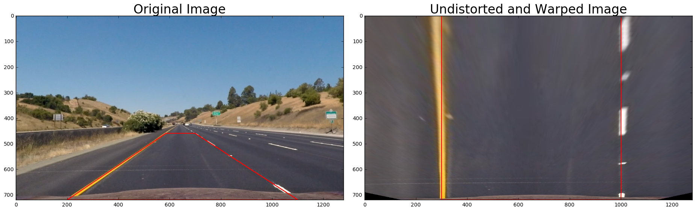


To further test our warper matrix, I am going to run it on all test images and save to an output folder. 


```python
import os
images = glob.glob('test_images/*.jpg')

for idx, fname in enumerate(images):
    img = cv2.imread(fname)
    undist = cv2.undistort(img, mtx, dist, None, mtx)
    image_name=os.path.split(fname)[1]
    warped = cv2.warpPerspective(undist, M, (img.shape[1], img.shape[0]) , flags=cv2.INTER_LINEAR)  
    out_name = 'test_images_warped/'+'warped_'+image_name
    cv2.imwrite(out_name, warped)
```

#### 4. Polynomial fit of the lane-line pixels

First, I am defining a few helper function to tie my image process pipepline together.


```python
def undistort(img):
    result = cv2.undistort(img, mtx, dist, None, mtx)
    return result

def warp(img):
    result = cv2.warpPerspective(img, M, (img.shape[1], img.shape[0]) , flags=cv2.INTER_LINEAR)
    return result

def undist_pipeline_warp(img):
    undist = undistort(img)
    color_binary, binary = pipeline(img,s_thresh=(110, 255),sx_thresh=(25, 255))
    combined_binary = 255*np.dstack((binary,binary,binary)).astype('uint8')
    result = warp(combined_binary)
    return result, combined_binary

img = plt.imread('test_images/test3.jpg')
warped_binary, intermediate_binary = undist_pipeline_warp(img)

draw_two_imgs(img, warped_binary, title2='Warped Binary')
```


#### 4.1 Using histogram to identify lane-line starting point

Now that we have our warped binary image (see above, on the left side). I will plot a histogram of the pixels along all the columns in the lower half of the image like this. Since in our warp function, we created warped image with all three channels (the values are identical from channel to channel), we just need to grab the first channel to perform the histgoram calculation


```python
single_channel = warped_binary[:,:,0]
histogram = np.sum(single_channel[int(single_channel.shape[0]/2):,:], axis=0)
print(histogram.shape)
print(np.argmax(histogram))
plt.plot(histogram)
```

    (1280,)
    345


    [<matplotlib.lines.Line2D at 0x10bcec208>]


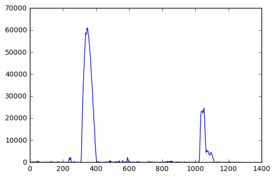


#### 4.2 Sliding window line detection

Once we identify the starting position of both left and right lane line at the bottom. We are going to use sliding window to move up and find all pixels belonging to the lines. Once we located the lane line pixels, we can then use their x and y pixel positions to fit a second order polynomial curve.


```python
def sliding_window(binary_warped):
    global out_img
    out_img = np.copy(binary_warped)

    single_channel = binary_warped[:,:,0]
    histogram = np.sum(single_channel[int(single_channel.shape[0]/2):,:], axis=0)
    midpoint = np.int(histogram.shape[0]/2)
    
    leftx_base = np.argmax(histogram[:midpoint])
    rightx_base = np.argmax(histogram[midpoint:]) + midpoint
    center_offset = int((leftx_base+rightx_base)/2) - midpoint
    #print('Inital left, midpoint, right, center_offset: ', midpoint, leftx_base, rightx_base, center_offset)

    # Choose the number of sliding windows
    nwindows = 9
    # Set height of windows
    window_height = np.int(warped_binary.shape[0]/nwindows)
    # Identify the x and y positions of all nonzero pixels in the image
    nonzero = warped_binary.nonzero()
    nonzeroy = np.array(nonzero[0])
    nonzerox = np.array(nonzero[1])
    # Current positions to be updated for each window
    leftx_current = leftx_base
    rightx_current = rightx_base
    # Set the width of the windows +/- margin
    margin = 100
    # Set minimum number of pixels found to recenter window
    minpix = 50
    # Create empty lists to receive left and right lane pixel indices
    left_lane_inds = []
    right_lane_inds = []

    # Step through the windows one by one
    for window in range(nwindows):
        # Identify window boundaries in x and y (and right and left)
        win_y_low = binary_warped.shape[0] - (window+1)*window_height
        win_y_high = binary_warped.shape[0] - window*window_height
        win_xleft_low = leftx_current - margin
        win_xleft_high = leftx_current + margin
        win_xright_low = rightx_current - margin
        win_xright_high = rightx_current + margin
        # Draw the windows on the visualization image
        cv2.rectangle(out_img,(win_xleft_low,win_y_low),(win_xleft_high,win_y_high),color=[0,255,0], thickness=2)
        cv2.rectangle(out_img,(win_xright_low,win_y_low),(win_xright_high,win_y_high),color=[0,255,0], thickness=2) 
        # Identify the nonzero pixels in x and y within the window
        good_left_inds = ((nonzeroy >= win_y_low) & (nonzeroy < win_y_high) & (nonzerox >= win_xleft_low) & (nonzerox < win_xleft_high)).nonzero()[0]
        good_right_inds = ((nonzeroy >= win_y_low) & (nonzeroy < win_y_high) & (nonzerox >= win_xright_low) & (nonzerox < win_xright_high)).nonzero()[0]
        # Append these indices to the lists
        left_lane_inds.append(good_left_inds)
        right_lane_inds.append(good_right_inds)
        # If you found > minpix pixels, recenter next window on their mean position
        if len(good_left_inds) > minpix:
            leftx_current = np.int(np.mean(nonzerox[good_left_inds]))
        if len(good_right_inds) > minpix:        
            rightx_current = np.int(np.mean(nonzerox[good_right_inds]))

    # Concatenate the arrays of indices
    left_lane_inds = np.concatenate(left_lane_inds)
    right_lane_inds = np.concatenate(right_lane_inds)
    out_img[nonzeroy[left_lane_inds], nonzerox[left_lane_inds]] = [255, 0, 0]
    out_img[nonzeroy[right_lane_inds], nonzerox[right_lane_inds]] = [0, 0, 255]

    # Extract left and right line pixel positions
    leftx = nonzerox[left_lane_inds]
    lefty = nonzeroy[left_lane_inds] 
    rightx = nonzerox[right_lane_inds]
    righty = nonzeroy[right_lane_inds] 
    
    left_fit = []
    right_fit = []
    lanes_detected = False

    if leftx.shape[0] > 1 and rightx.shape[0] > 1:
        lanes_detected = True
        
    # Fit a second order polynomial to each
    left_fit = np.polyfit(lefty, leftx, 2)
    right_fit = np.polyfit(righty, rightx, 2)
    return lanes_detected, center_offset, left_fit, right_fit
    
lanes_detected, center_offset, left_fit, right_fit = sliding_window(warped_binary)
# Generate x and y values for plotting
ploty = np.linspace(0, warped_binary.shape[0]-1, warped_binary.shape[0] )
left_fitx = left_fit[0]*ploty**2 + left_fit[1]*ploty + left_fit[2]
right_fitx = right_fit[0]*ploty**2 + right_fit[1]*ploty + right_fit[2]
```


```python
# plotting
plt.imshow(out_img)
plt.plot(left_fitx, ploty, color='yellow')
plt.plot(right_fitx, ploty, color='yellow')
plt.xlim(0, 1280)
plt.ylim(720, 0)
```


    (720, 0)


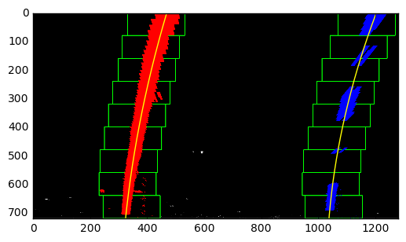


#### 4.3 Lane detection on subsequent frames

Once we detected the lane lines on the first image frame, we don't have to use the sliding window anymore because the lane lines should be generally around where they were from the previous frame.


```python
def subsequent_frame(binary_warped, left_fit, right_fit):
    if len(binary_warped.shape) > 2:
        single_channel = binary_warped[:,:,0]
    else:
        single_channel = binary_warped

    histogram = np.sum(single_channel[int(single_channel.shape[0]/2):,:], axis=0)
    midpoint = np.int(histogram.shape[0]/2)    
    leftx_base = np.argmax(histogram[:midpoint])
    rightx_base = np.argmax(histogram[midpoint:]) + midpoint
    center_offset = int((leftx_base+rightx_base)/2) - midpoint
    #print('Subsequent left, midpoint, right, center_offset: ', midpoint, leftx_base, rightx_base, center_offset)

    nonzero = binary_warped.nonzero()
    nonzeroy = np.array(nonzero[0])
    nonzerox = np.array(nonzero[1])
    margin = 100
    left_lane_inds = ((nonzerox > (left_fit[0]*(nonzeroy**2) + left_fit[1]*nonzeroy + left_fit[2] - margin)) & (nonzerox < (left_fit[0]*(nonzeroy**2) + left_fit[1]*nonzeroy + left_fit[2] + margin))) 
    right_lane_inds = ((nonzerox > (right_fit[0]*(nonzeroy**2) + right_fit[1]*nonzeroy + right_fit[2] - margin)) & (nonzerox < (right_fit[0]*(nonzeroy**2) + right_fit[1]*nonzeroy + right_fit[2] + margin)))  

    # Again, extract left and right line pixel positions
    leftx = nonzerox[left_lane_inds]
    lefty = nonzeroy[left_lane_inds] 
    rightx = nonzerox[right_lane_inds]
    righty = nonzeroy[right_lane_inds]

    lanes_detected = False
    if leftx.shape[0] > 1 and rightx.shape[0] > 1:
        lanes_detected = True

    # Fit a second order polynomial to each
    left_fit = np.polyfit(lefty, leftx, 2)
    right_fit = np.polyfit(righty, rightx, 2)
    
    # Generate x and y values for plotting
    ploty = np.linspace(0, binary_warped.shape[0]-1, binary_warped.shape[0] )
    left_fitx = left_fit[0]*ploty**2 + left_fit[1]*ploty + left_fit[2]
    right_fitx = right_fit[0]*ploty**2 + right_fit[1]*ploty + right_fit[2]
    return lanes_detected, center_offset, left_fit, right_fit 

img = plt.imread('test_images/test3.jpg')
binary, _= undist_pipeline_warp(img)
binary_warped = binary[:,:,0]
print('undist_pipeline_warp returns 3-channels: ', binary.shape)
print('binary_warped.shape', binary_warped.shape)

detected,center_offset,left_fit,right_fit = subsequent_frame(binary_warped, left_fit, right_fit)

# Create an image to draw on and an image to show the selection window
out_img = np.dstack((binary_warped, binary_warped, binary_warped))*255
window_img = np.zeros_like(out_img)
# Color in left and right line pixels
#out_img[nonzeroy[left_lane_inds], nonzerox[left_lane_inds]] = [255, 0, 0]
#out_img[nonzeroy[right_lane_inds], nonzerox[right_lane_inds]] = [0, 0, 255]

# Generate a polygon to illustrate the search window area
# And recast the x and y points into usable format for cv2.fillPoly()
margin = 100
left_line_window1 = np.array([np.transpose(np.vstack([left_fitx-margin, ploty]))])
left_line_window2 = np.array([np.flipud(np.transpose(np.vstack([left_fitx+margin, ploty])))])
left_line_pts = np.hstack((left_line_window1, left_line_window2))
right_line_window1 = np.array([np.transpose(np.vstack([right_fitx-margin, ploty]))])
right_line_window2 = np.array([np.flipud(np.transpose(np.vstack([right_fitx+margin, ploty])))])
right_line_pts = np.hstack((right_line_window1, right_line_window2))

# Draw the lane onto the warped blank image
cv2.fillPoly(window_img, np.int_([left_line_pts]), (0,255, 0))
cv2.fillPoly(window_img, np.int_([right_line_pts]), (0,255, 0))
result = cv2.addWeighted(out_img, 1, window_img, 0.3, 0)
plt.imshow(result)
plt.plot(left_fitx, ploty, color='yellow')
plt.plot(right_fitx, ploty, color='yellow')
plt.xlim(0, 1280)
plt.ylim(720, 0)
    
    
```

    undist_pipeline_warp returns 3-channels:  (720, 1280, 3)
    binary_warped.shape (720, 1280)


    (720, 0)


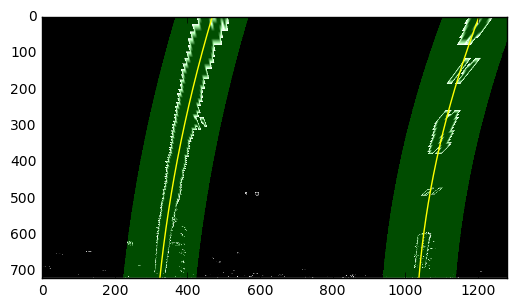


#### 4.4 Measuring Curvature


```python
# Generate some fake data to represent lane-line pixels
quadratic_coeff = 3e-4 # arbitrary quadratic coefficient
ploty_sample = np.linspace(0, 719, num=720)# to cover same y-range as image
# For each y position generate random x position within +/-50 pix
# of the line base position in each case (x=200 for left, and x=900 for right)
leftx_sample = np.array([200 + (y**2)*quadratic_coeff + np.random.randint(-50, high=51) 
                              for y in ploty_sample])
rightx_sample = np.array([900 + (y**2)*quadratic_coeff + np.random.randint(-50, high=51) 
                                for y in ploty_sample])

def calculate_curvature(midoffset, leftx, rightx, ploty, do_plot=False):
    #leftx = leftx[::-1]  # Reverse to match top-to-bottom in y
    #rightx = rightx[::-1]  # Reverse to match top-to-bottom in y

    # Fit a second order polynomial to pixel positions in each fake lane line
    left_fit = np.polyfit(ploty, leftx, 2)
    left_fitx = left_fit[0]*ploty**2 + left_fit[1]*ploty + left_fit[2]
    right_fit = np.polyfit(ploty, rightx, 2)
    right_fitx = right_fit[0]*ploty**2 + right_fit[1]*ploty + right_fit[2]

    # Plot up the fake data
    if do_plot is True:
        mark_size = 3
        plt.plot(leftx, ploty, 'o', color='red', markersize=mark_size)
        plt.plot(rightx, ploty, 'o', color='blue', markersize=mark_size)
        plt.xlim(0, 1280)
        plt.ylim(0, 720)
        plt.plot(left_fitx, ploty, color='green', linewidth=3)
        plt.plot(right_fitx, ploty, color='green', linewidth=3)
        plt.gca().invert_yaxis() # to visualize as we do the images

    # Define y-value where we want radius of curvature
    # I'll choose the maximum y-value, corresponding to the bottom of the image
    y_eval = np.max(ploty)
    left_curverad = ((1 + (2*left_fit[0]*y_eval + left_fit[1])**2)**1.5) / np.absolute(2*left_fit[0])
    right_curverad = ((1 + (2*right_fit[0]*y_eval + right_fit[1])**2)**1.5) / np.absolute(2*right_fit[0])
    #print('Curvature in pixel space: ', left_curverad, right_curverad)

    # Define conversions in x and y from pixels space to meters
    ym_per_pix = 30/720 # meters per pixel in y dimension
    xm_per_pix = 3.7/700 # meters per pixel in x dimension

    # Fit new polynomials to x,y in world space
    left_fit_cr = np.polyfit(ploty*ym_per_pix, leftx*xm_per_pix, 2)
    right_fit_cr = np.polyfit(ploty*ym_per_pix, rightx*xm_per_pix, 2)
    
    # Calculate the new radii of curvature
    left_curverad = ((1 + (2*left_fit_cr[0]*y_eval*ym_per_pix + left_fit_cr[1])**2)**1.5) / np.absolute(2*left_fit_cr[0])
    right_curverad = ((1 + (2*right_fit_cr[0]*y_eval*ym_per_pix + right_fit_cr[1])**2)**1.5) / np.absolute(2*right_fit_cr[0])
    # Now our radius of curvature is in meters
    curvature = 0.5*(round(right_curverad/1000,1) + round(left_curverad/1000,1))
    # vehicle/camera center position in CM
    position = round(100*midoffset*xm_per_pix, 1) 
    return position, curvature

#calculate_curvature(leftx_sample, rightx_sample, ploty_sample)
position, curvature = calculate_curvature(center_offset,left_fitx, right_fitx, ploty, do_plot=True)
```


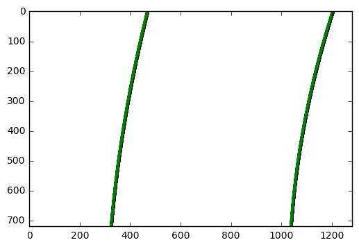


#### 4.5 Lane Area Overlay

First, we create an empty image to draw the lines on. Then we recast the x and y points into usable format for cv2.fillPoly() and draw the fitted lanes onto the warped blank image. We use the previsouly calculated inverse perspective matrix MInv to warp the lane image back to the original image space. The last step is to combine the lane image and camera-corrected original image. 


```python
def overlay_lane_lines(img,midoffset,left_fitx,right_fitx,yvals,curv_overlay=False):
    lanefit_image = np.zeros_like(img).astype(np.uint8)

    left = np.array([np.transpose(np.vstack([left_fitx, yvals]))])
    right = np.array([np.flipud(np.transpose(np.vstack([right_fitx, yvals])))])
    points = np.hstack((left, right))
    cv2.fillPoly(lanefit_image, np.int_([points]), (0, 255, 0))

    undist = undistort(img)
    inverse_warp = cv2.warpPerspective(lanefit_image, MInv, (img.shape[1], img.shape[0])) 
    result = cv2.addWeighted(undist, 1, inverse_warp, 0.3, 0)
    if curv_overlay is True:
        position, curvature = calculate_curvature(midoffset, left_fitx, right_fitx, yvals, do_plot=False)
        pos_str = str('Vehicle Center Offset: '+str(position)+"cm")
        curv_str = str('Radius of Curvature: '+str(curvature)+'km')
        font = cv2.FONT_HERSHEY_SIMPLEX
        cv2.putText(result, curv_str,(430,670), font, 1,(0,0,255),2,cv2.LINE_AA)
        cv2.putText(result, pos_str,(420,620), font, 1,(0,0,255),2,cv2.LINE_AA)

    return result

img = plt.imread('test_images/test1.jpg')
overlay = overlay_lane_lines(img, center_offset, left_fitx, right_fitx, ploty, curv_overlay=True)

draw_two_imgs(img, overlay, title2='Overlay')
```


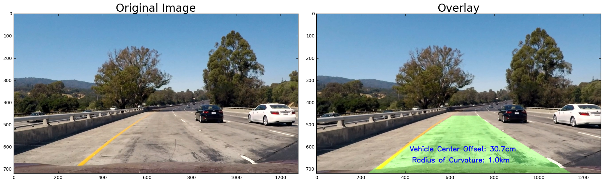


### 5. Pipeline (video)

#### 5.1 Process image frame

I created a function called `process_image`, that will take an image as parameter and run through the pipeline we have developed so far. I used image test4.jpg to test my pipeline. It looks pretty good!


```python
from moviepy.editor import VideoFileClip
from IPython.display import HTML
#import imageio
#imageio.plugins.ffmpeg.download()
```


```python
lanes_detected = None
left_fit = []
right_fit = []
def process_image(img):
    # NOTE: The output you return should be a color image (3 channel) for processing video below
    global lanes_detected, left_fit, right_fit
    image = undistort(img)
    warped_binary, intermediate_binary = undist_pipeline_warp(img)
    if lanes_detected is None:
        ## print('Lanes not detected yet, try sliding window')
        lanes_detected,mid_offset,left_fit,right_fit = sliding_window(warped_binary)

    if lanes_detected is True:
        lanes_detected,mid_offset,left_fit,right_fit = subsequent_frame(warped_binary, left_fit, right_fit)

        # Generate x and y values for plotting
        ploty = np.linspace(0, warped_binary.shape[0]-1, warped_binary.shape[0] )
        left_fitx = left_fit[0]*ploty**2 + left_fit[1]*ploty + left_fit[2]
        right_fitx = right_fit[0]*ploty**2 + right_fit[1]*ploty + right_fit[2]
        image = overlay_lane_lines(img,mid_offset,left_fitx,right_fitx,ploty,curv_overlay=True)
    else:
        ## print('Not detect, try next frame')
        lanes_detected = None
        
    return image
```


```python
img = plt.imread('test_images/test3.jpg')
overlay = process_image(img)

draw_two_imgs(img, overlay, title2='Overlay')
```


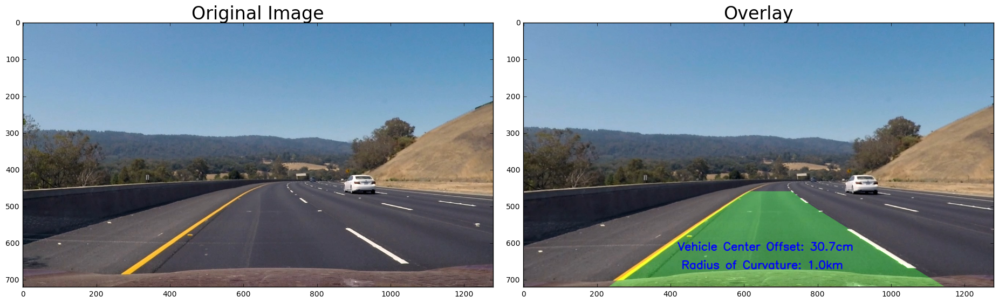


#### 5.2 Saving video

Here we use moviepy's VideoFileClip to grab each frame and feed it through my developed pipeline. The output video file is save in `project_video_out.mp4`.


```python
video_output = 'project_video_out.mp4'
clip1 = VideoFileClip("project_video.mp4")
#clip1 = VideoFileClip("solidWhiteRight.mp4")
processed_clip = clip1.fl_image(process_image) #NOTE: this function expects color images!!
%time processed_clip.write_videofile(video_output, audio=False)
```

    [MoviePy] >>>> Building video project_video_out.mp4
    [MoviePy] Writing video project_video_out.mp4


    100%|█████████▉| 1260/1261 [06:08<00:00,  3.41it/s]


    [MoviePy] Done.
    [MoviePy] >>>> Video ready: project_video_out.mp4 
    
    CPU times: user 6min 13s, sys: 1min 14s, total: 7min 28s
    Wall time: 6min 9s


#### 6 Discussions

This project is a challenging one for anyone who does not have a solid background in computer vision or OpenCV. What was covered in video classes fortunately were all that are required to complete the project. But it did take me a while to piece everything together. 

Two major difficulties arose during the project. The first is to identify the image points and object points in order to calculate the perspective matrix. It took some time to wrap my mind around what is going on. 

The second difficulty is to come up with the right combination of threshold filters (gradient threshold, color threshold, S v.s. L channel thresholds). There are just a lot of parameters to deal with. I feel like this is the area where a lot of improvements can be made in the future. The current pipeline does not well on the challenge video and I suspect that a lot fine-tuning in this area should help. 
